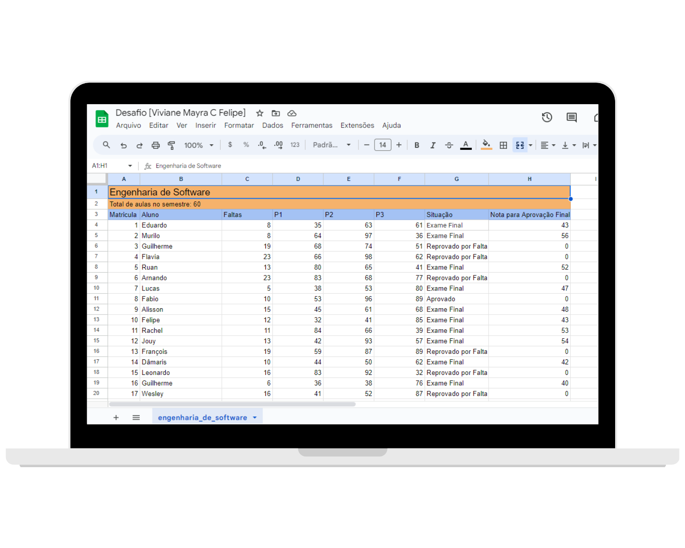
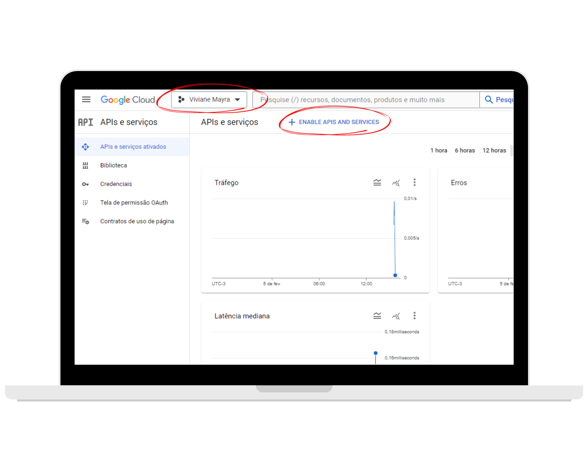
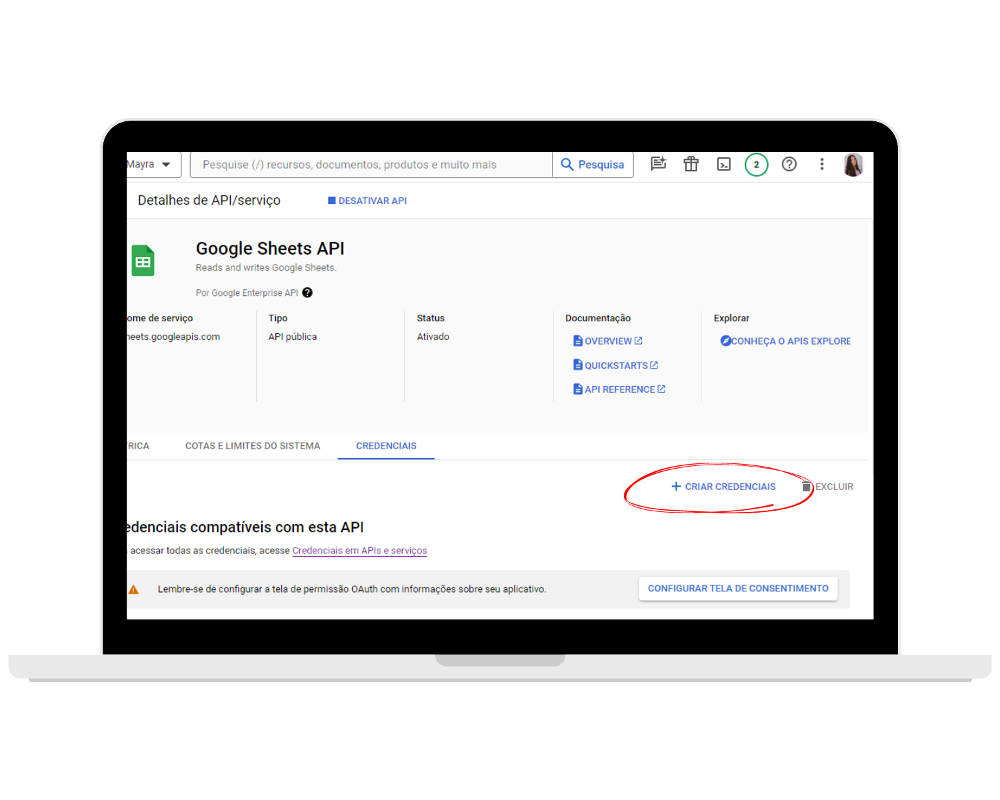

# Google Sheets Node.js Application



This is a Node.js program capable of reading a Google Sheets spreadsheet, searching for the necessary information, calculating and writing the result in the spreadsheet.

## Steps to Troubleshoot the Problem

1. **Get Google Sheets API Credentials**

   - Access [console.developers.google.com](https://console.developers.google.com/) and log in with your Google account.
     
   - Create a new project or select an existing project and then you must activate APIs and Services for your project.
   - Select the desired service. In the search, just search for Google Sheets API and activate it.
     
   - In the side menu, click on "Credentials".
     
   - Create a new credential of type "Service Account"
     
   - Create your key and download the JSON file
     
   - Renomeie o arquivo para `credentials.json` e salve-o em um local seguro em seu projeto.

2. **Base spreadsheet for application**

The following spreadsheet will be used as a basis for testing this program:

[Planilha de Teste](https://docs.google.com/spreadsheets/d/128R6Jqf3rwZlleS7nscN7ufVRTukGOnIFFkfMP7Pd8g/edit#gid=0)

## Settings

1. **Clone the Repository:**

```bash
 git clone https://github.com/seu-usuario/google-sheets-challenge.git
 cd google-sheets-challenge

```

2. **Install Dependencies**

   - Make sure you have Node.js and npm installed on your system.
   - In the terminal, navigate to the project directory and run the command:
     ```
     npm install
     ```

## Run the Program

-After successful installation of dependencies, run the Node.js program with the following command:

```
node index.js
```

## Check Spreadsheet Updates

- After successful execution, check your Google Sheets spreadsheet to see the updates made by the program.

## Program Rules

Calculate the situation of each student based on the average of the 3 tests (P1, P2 and P3)

- `m<5`: Failed by Grade
- `5<=m<7`: Final exam
- `m>=7`: Approved

If the number of absences exceeds 25% of the total number of classes, the student will have the status "Failed due to Absence", regardless of the average.

If the situation is "Final Exam", it is necessary to calculate the "Final Approval Grade" (naf) for each student according to the following formula:

```
  5 <= (m + naf)/2
```

If the student's status is different from "Final Exam", fill in the "Grade for Final Approval" field with 0.

Round the result to the next whole number (increase) if necessary.
